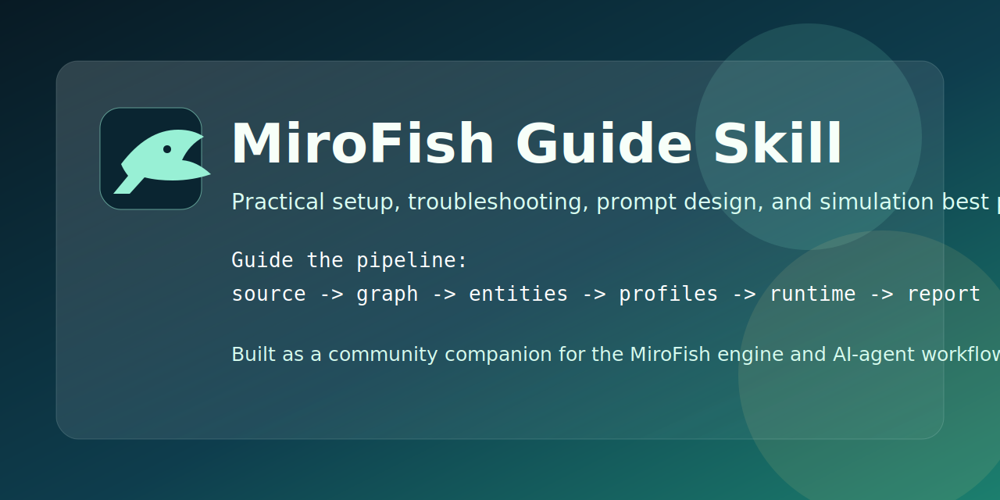

# MiroFish Guide Skill

> Community guide and AI-agent skill for working with the [MiroFish](https://github.com/666ghj/MiroFish) engine.

[](https://opensource.org/licenses/MIT)
[](https://github.com/666ghj/MiroFish)



## Purpose

The upstream `MiroFish` repository explains the product and how to launch it.
This repository serves a different job:

- capture repeatable MiroFish practices in one place;
- turn those practices into a portable `SKILL.md` for AI coding agents;
- document the parts of the engine that matter when you are trying to get better outputs, debug failures, or maintain a support repository around MiroFish.

In short: `MiroFish` is the engine, `mirofish-guide` is the operator's playbook and reusable skill layer.

## What Problems This Repository Solves

This repository is for the people searching for:

- `MiroFish guide`
- `MiroFish guide skill`
- `MiroFish tutorial`
- `MiroFish setup`
- `MiroFish troubleshooting`
- `MiroFish best practices`
- `MiroFish skill`
- `MiroFish prompt design`
- `MiroFish seed text`
- `MiroFish report debugging`

If MiroFish feels powerful but hard to operate consistently, this repository is meant to close that gap.

## What This Repository Covers

This guide is grounded in the current MiroFish pipeline:

1. upload source material (`pdf`, `md`, `txt`, `markdown`);
2. build a Zep graph from chunked text;
3. filter entities for simulation;
4. generate OASIS agent profiles;
5. generate simulation config with an LLM;
6. run Twitter and Reddit simulations in parallel;
7. generate a report and interact with the simulated world.

The repository focuses on the practices around that pipeline:

- source document and seed-text quality;
- simulation requirement writing;
- interpreting entity and persona generation;
- tuning runs without guessing blindly;
- debugging from generated artifacts and logs;
- recording empirical findings separately from code-confirmed facts.

## Repository Contents

```text
mirofish-guide/
|-- SKILL.md
|-- references/
|   |-- workflow.md
|   |-- debugging.md
|   |-- seed-templates.md
|   `-- experiments.md
|-- agents/
|   `-- openai.yaml
|-- assets/
|   |-- mirofish-guide-banner.svg
|   `-- mirofish-guide-mark.svg
|-- CONTRIBUTING.md
|-- SECURITY.md
|-- README.md
`-- LICENSE
```

- `SKILL.md`: the compact skill entry point for Claude Code, OpenClaw, Codex-style workflows, and similar agents.
- `references/workflow.md`: the engine map, stage by stage.
- `references/debugging.md`: artifact-level troubleshooting guide.
- `references/seed-templates.md`: reusable source-material and simulation-requirement templates.
- `references/experiments.md`: empirical run notes and tuning observations.

## How To Use It

### As a skill

Point your agent at [`SKILL.md`](SKILL.md). The skill is designed to route the agent into the right reference file instead of dumping the entire guide into context.

Use it when the task is about:

- planning or running MiroFish simulations;
- improving prompts, seed material, or operator workflows;
- debugging graph, entity, profile, config, runtime, or report stages;
- maintaining a repository that documents MiroFish best practices.

### As a standalone repo

Start with [`SKILL.md`](SKILL.md), then open the relevant reference:

- [`references/workflow.md`](references/workflow.md) for architecture and stage mapping;
- [`references/debugging.md`](references/debugging.md) for operational problems;
- [`references/seed-templates.md`](references/seed-templates.md) for reusable input patterns;
- [`references/experiments.md`](references/experiments.md) for empirical tradeoffs.

## Quick Start

1. Read [`references/workflow.md`](references/workflow.md) to locate the stage you are working on.
2. Use [`references/seed-templates.md`](references/seed-templates.md) to prepare stronger source material and simulation requirements.
3. If something fails or looks weak, go to [`references/debugging.md`](references/debugging.md).
4. If you are comparing models, cost, or run quality, go to [`references/experiments.md`](references/experiments.md).

## Who This Is For

- MiroFish users trying to get better simulation outputs
- contributors maintaining internal or public MiroFish playbooks
- AI-agent users who want a reusable MiroFish skill
- people debugging graph extraction, persona generation, runtime behavior, or report quality

## Core Principles

1. Treat source material quality as the main quality lever. Weak inputs create weak entities, weak personas, and weak reports.
2. Separate code-confirmed behavior from experiment-only observations. Do not present guesses as engine facts.
3. Debug from artifacts first. MiroFish writes useful state, config, profile, and report files; use them before patching code.
4. Prefer changes in seed material and simulation requirements before invasive engine changes.
5. Keep the guide repository sharper than the engine README: shorter claims, more verification, better operator context.

## Safety And Hygiene

This repository should never become a dump of local context or private data.

- do not commit `.env` files, exports, run logs, uploads, or private datasets;
- redact keys, tokens, internal URLs, and user-identifying content from examples;
- keep empirical notes useful without exposing confidential source material;
- follow [`SECURITY.md`](SECURITY.md) when adding examples or logs.

## Contribution Priorities

- add code-grounded notes tied to concrete engine files or generated artifacts;
- add new experiment logs with model, rounds, action counts, and constraints;
- add repeatable prompt or seed templates for real MiroFish use cases;
- document version drift when upstream MiroFish behavior changes.

See [`CONTRIBUTING.md`](CONTRIBUTING.md) for the expected format.

## Related

- [MiroFish](https://github.com/666ghj/MiroFish): the engine itself
- [OASIS](https://github.com/camel-ai/oasis): the underlying simulation framework
- [Zep](https://www.getzep.com/): graph and memory service used by MiroFish

## License

MIT.
